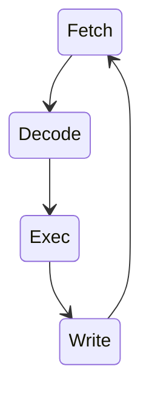
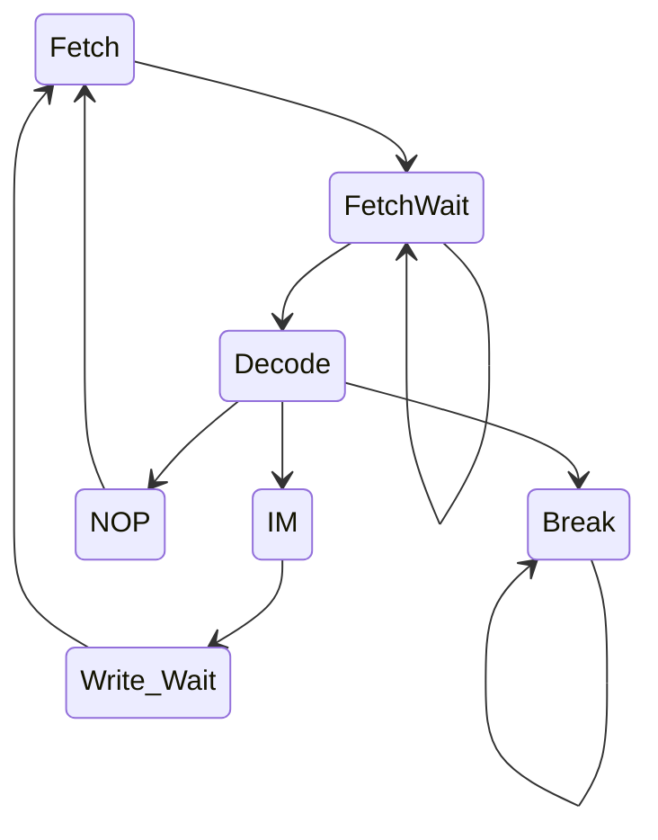

# A ~maldita~ UC

## Maquina de estados
A unidade de controle é uma grande [maquina de estados](https://balbertini.github.io/fsmbasics-pt_BR.html)
onde há um passo a passo para cada instrução mexendo nos sinais de controle do
fluxo de dados.

Processadores geralmente seguem a seguinte ordem de intruções:

Como no caso do polistack tem instruções que levam mais de um ciclo precisamos
transformar o estado de __exec__ em mais estados. Além disso temos uma memoria
que demora para responder, então precisamos de alguns estados intermediarios para
esperar a sua resposta.

Um exemplo de como eu estou montando* minha maquina de estados da seguinte forma:

## Detalhando cada estado

### Fetch
O estado de Fetch é responsavel por salvar a instrução que será analisada
no resto do ciclo. Como vamos precisar usar a memoria para outras coisas saimos
a parte que precisamos da memoria (os 8 primeiros bits) no registrador IR.
Para isso precisamos jogar o endereço da instrução atual (PC) no endereço A da
memoria (`memA_addr`), para isso ultilizamos o mux da porta, selecionado o sinal
de controle (`mem_a_addr_src`) para `'1'`.
