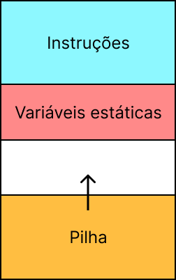

# O Polistack

O polistack é um [processador de pillha](wtf_stack.md) com 3 registradores:
- IR (Instrução): guarda a instrução que está sendo realizada
- PC (Contador de Programa): quarda o endereço da instrução que está/será executada.
- SP (Ponteiro da memoria): ponteiro para o topo da pilha.

Além disso temos:
- uma ULA:  para realizar operações aritimeticas
- uma memoria: para guardar instrução, a pilha e outros valores.
- uma ISA (conjunto de intruções) de 1 byte


## A memoria
A memoria usada é uma memoria com palavras de 1 byte, exatamente uma instrução e
um valor ocupando `s_word/8`, para a palavra do processador de 32 bits ocupa 4 "casinhas de memoria".

No topo da memoria temos nosso programa, e começando na parte inferior temos a pilha.
Ainda no meio do caminho temos um espaço de memoria não ocupada que pode ser atribuida a variaveis.



## PC, IR e instruções
Como a instrução ocupa apenas um byte,
pegamos sempre os 8 primeiros bits da memoria lida, para colocar no registrador IR.

Além disso para ler a proxima instrução precisamos somar apenas 1 no PC para
começar a pegar a proxima instrução.

Além do funcionamento normal de passar por todas as instruções, pode haver "loops",
"ifs" e até "chamadas de função" onde há saltos no codigo. Por exemplo, pense no codigo a seguir:
```
IM 0
POPPC
```

## SP e stackpointer
A pilha cresce de baixo pra cima, então sempre que vamos escrever precisamos
subtrair 4 do stack pointer para então escrever. Elá funciona como uma pilha normal,
entretanto pela a palavra da memoria ser menor q a do processador lemos a partir do endereço base até completar o valor.

## Implementação
Por se tratar de um circuto grande costumamos dividir em ele duas partes,
o fluxo de dados (DF) e a unidade de controle (UC).

O fluxo de dados é quem faz o trabalho, nele estão os registradores, a ula e o muxs.

A unidade de controle coordena qual a sequencia de passos que deve ser realizada,
controlando os sinais de controle (controle dos mux e enables).

<!---
## TODO:
    - Desenhar diagrama da stack
    - Explicar melhor a stack no contexto da memoria de 8 bits
--->
